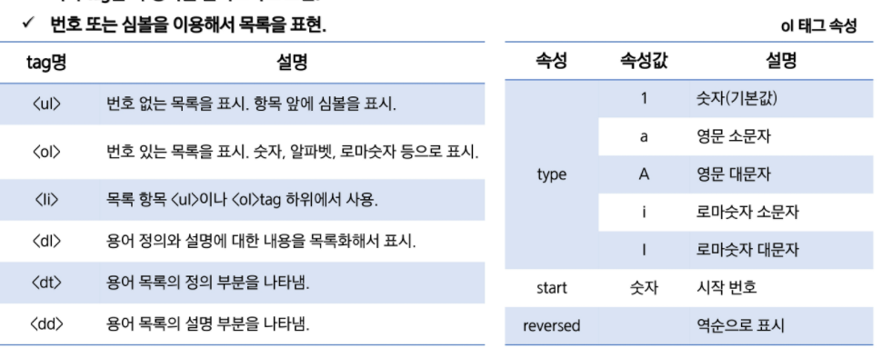
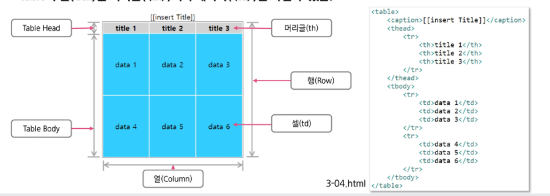
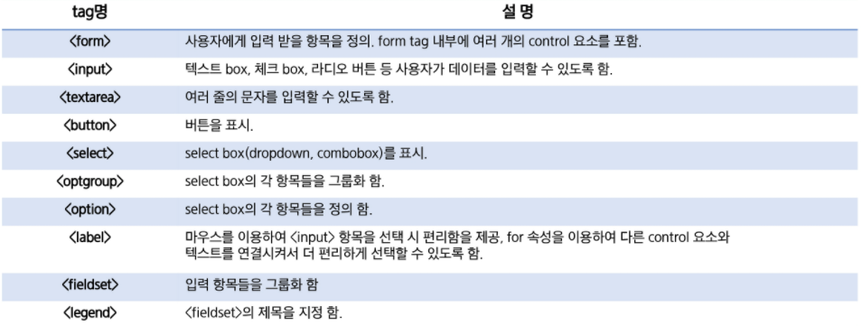
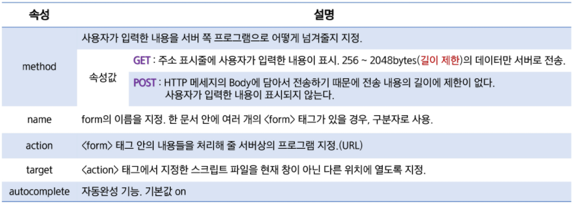
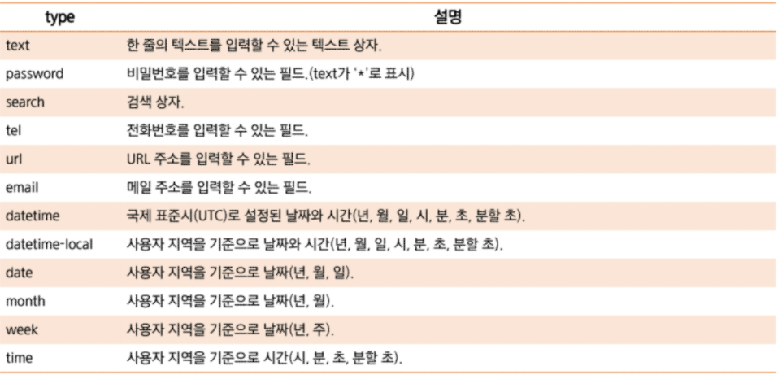
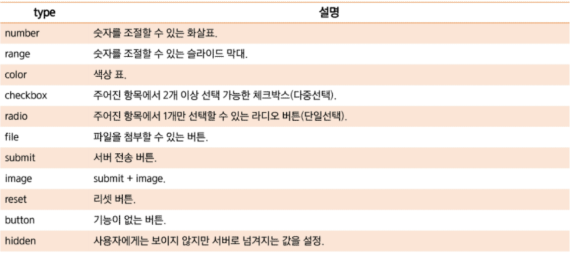
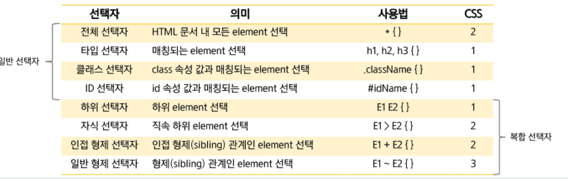

## HTML5 & CSS3 소개

## HTML5 기본

- HTML5 웹 문서를 구성하는 3가지 요소
  - HTML
    - 웹 페이지 문서 담당 (구조)
  - CSS
    - 웹 페이지 디자인 담당 (표현)
  - JS
    - 웹 페이지 이벤트 담당 (동작)
- HTML은 마크업 언어로 웹 문서를 작성하며 tag를 사용하며 문서의 구조 등을 기술하는 언어
  - tag는 시작 tag과 종료 tag로 쌍을 이루거나 시작 tag만 존재하는 tag도 있다.
- HTML tag에는 어느 tag에나 넣어서 사용할 수 있는 글로벌속성이 있다.
  - class
    - tag에 적용할 스타일의 이름을 지정
    - 중복 허용
  - dir
    - 내용의 텍스트 방향을 지정
    - 왼쪽>>오른쪽(기본값, ltr)
    - 오른쪽>>왼쪽(rtl)
  - id
    - 유일한 ID를 지정함, js에서 주로 사용
    - 중복 불가
  - style
    - 인라인 스타일 적용
  - title
    - tag에 추가 정보 지정, tag에 마우스 포인터를 위치할 경우 title의 값 표시
- 주석
  - 주석의 내용은 브라우저에 출력이 되지 않는다.
    - 주석이 넘어오기는 한다.
  - HTML tag의 내용을 설명하기 위한 용도로 사용

## HTML5 Markup Elements

- 포맷팅 요소
  - 화면에는 동일하게 출력되지만 각 요소가 가진 의미가 다른 것이 있다.
- 목록형 요소
  - 

- 테이블 요소

  - data를 메인으로 할 때
  - 
  - colspan, rowspan으로 열, 행 병합한다.

- 이미지 요소

- 링크 요소

  - target
    - _blank : 링크 내용이 새 창이나 새 탭에서 열린다
    - _self : target 속성의 기본 값으로 링크가 있는 화면에서 열린다.
  - #anchor
    - 특정 요소 클릭시 그 위치로 한 번에 이동한다.

  - map
    - 하나의 이미지에 여러 개의 link (click 위치에 다른 서로 다른 link)
  - link
    - 문서와 외부 자원을 연결하기 위해 사용
    - `<head>` 위치에 정의
    - 보통 CSS를 연결하기 위한 용도로 사용

- iframe

  - 화면의 일부분에 다른 문서를 포함
  - src 속성은 포함시킬 외부 문서의 경로를 지정

### form control 요소

- 개요

  - 사용자로부터 데이터를 입력 받아 서버에서 처리하기 위한 용도로 사용
  - 사용자의 요청에 따라 서버는 HTML form을 전달
  - 사용자는 HTML form에 적절한 데이터를 입력한 후 서버에 전송, submit
  - 서버는 사용자의 요청을 분석한 후 데이터를 등록하거나 원하는 데이터를 조회하거나 결과를 다시 반환

- tag

  - 

- 속성

  - 
  - 매우 중요
    - 특히 method, action
    - GET
      - 노출 염려
    - POST
      - 노출 X
      - 많은 데이터

- input tag

  - id 속성은 여러 번 사용된 폼 요소를 구분하기 위해 사용
    - 에러가 나지는 않는다. 다만 논리 에러라고 말할 수는 있다.

  - 
  - 

  - 파일 업로드 시, 폼 태그에 method = "post", enctype="multipart/form-data" 꼭 설정해야한다

### 공간 분할 태그

- block & inline 형식 태그

---

`>` : 자식

`+`: 형제

## CSS3 기본

- 외부 스타일 시트
- 내부 스타일 시트
- 인라인

## CSS3 이해

- 선택자의 이해
- 

## Semantic

