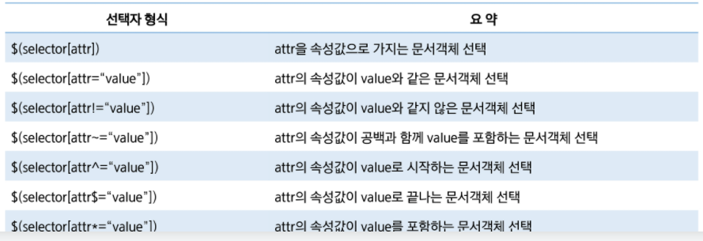

### jQuery 특징

- 어떤 브라우저에서도 동일하게 동작

- 브라우저 호환성을 고려하여 대체코드를 작성할 필요 없다

- 네이티브 DOM API보다 직관적이고 편리한 API제공하여 개발 속도를 향상

- API

  - http://api.jquery.com

- 기본구문

  - Selector 표현식과 Action 메서드를 조합한 형태로 구문

    - ```http
      $(selector).action():
      ```

- 선택자는 기본 js 문법과 동일

  - "*"
  - "#id"
    - 가장 빨리 선택
    - 제일 위에 있는 것만 반환하고 넘어감
  - "tagName"
  - ".class"

- 속성 선택자
  - 

- Event 처리
  - bind()
    - 동적으로 생성한 DOM 객체에는 적용이 안된다.
  - on()
    - 동적으로 생성한 DOM  객체에도 적용

$ npm install @types/jquery --save