### Web Architecture

- 클라이언트 <-> 서버
  - 요청과 응답
  - 클라이언트
    - 웹 브라우저 (data 발생) (HTML, CSS, JS)
  - 서버
    - 웹 서버 (HTTP Server)
      - 클라이언트 접속 응답 처리
    - 애플리케이션 서버 (Java)
      - 클라이언트 요청에 대한 로직 처리
      - Business Logic
      - Persistence Logic
      - Presentation
    - 위 2개가 웹 애플리케이션 서버 (WAS) / WebLogic, JEUS, Tomcat
    - RDBMS (Oracle, MySQL...)
      - 데이터베이스
      - JDBC로 WAS와 통신

### Servlet

- 자바 서블릿은 자바를 사용하여 웹페이지를 도적으로 생성하는 서버측 프로그램 혹은 그 사양을 말한다.
- 서블릿은 자바 코드 안에 HTML 포함
- JSP는 HTML 안에 java 코드 포함

### Servlet Life-Cycle

- main method가 없다.
- 객체의 생성부터 사용의 주체가 사용자가 아닌 Servlet Container에게 있다.
- 클라이언트가 요청을 하면, Servlet Container는 서블릿 객체를 생성(한번만) 하고 초기화(한번만) 하며, 요청에 대한 처리(요청시마다 반복)을 한다
- 서블릿 객체가 필요 없게 되면 제거하는 일까지 서블릿 컨테이너가 담당한다.

- 서블릿 메서드
  - 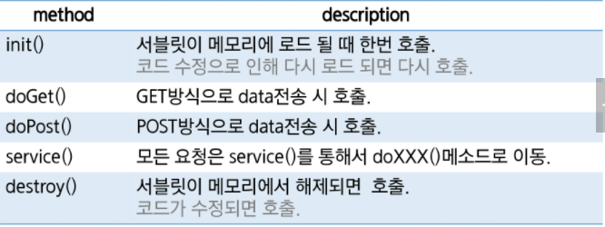
  - init(), destroy()는 맨 처음, 맨 마지막에 한번씩 사용

- 404 Error
  - 무조건 오타

### Servlet Parameter 처리

- 파라미터 전송방식
  - 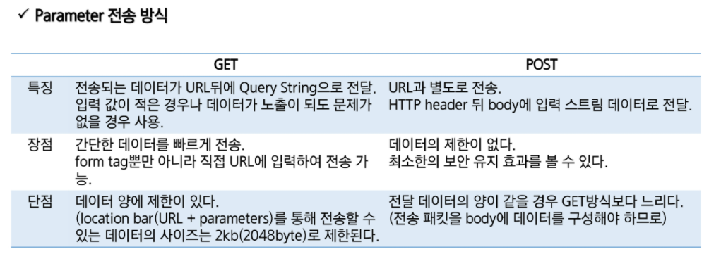
  - 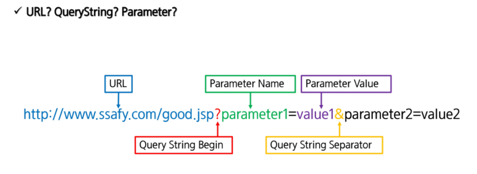

- doGet, doPost 차이
  - `request.setCharacterEncoding("utf-8");` 있고 없고
  - Post 방식은 반드시 이것을 해야한다.
  - get 방식은 쿼리로 넘어오기 때문에 안해도 괜춘
- 파라미터 받아오기
  - 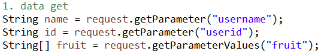
  - 일반적은 getParameter
  - 여러개는 getParameteValues (체크박스 같이 여러개)...

### JSP (Java Server Page)

- 최초 jsp 요청 시 jsp file 변경 시 jsp가 servlet으로 변경 됨
- 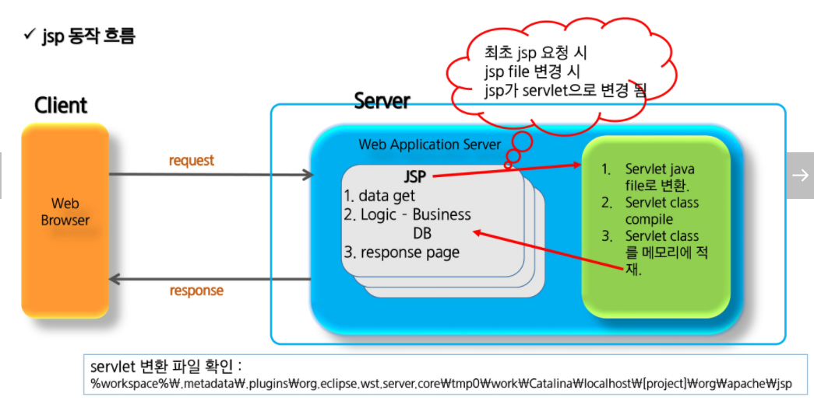

### JSP Scriptlet

- 선언
  - 멤버 변수 선언이나 메소드를 선언 하는 영역.
  - 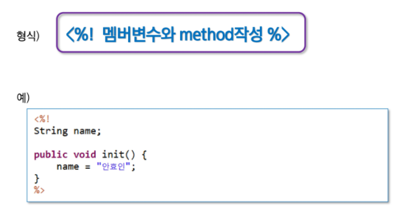
- 스크립트릿(Scriptlet)
  - java code 대부분 리퀘스트, 리스폰스
  - client 요청 시 매번 호출 영역으로 서블릿으로 변환 시 service() method에 해당되는 영역
  - 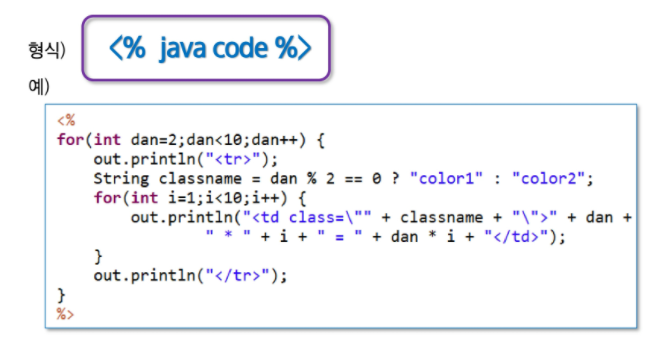
- 표현식
  - 데이터를 브라우저에 출력할 때 사용
  - 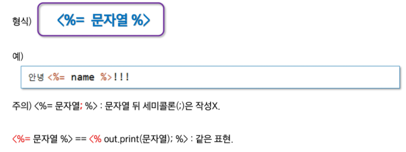
- 주석
  - `<%-- 주석할 코드 -- %>`

### JSP Directive

- 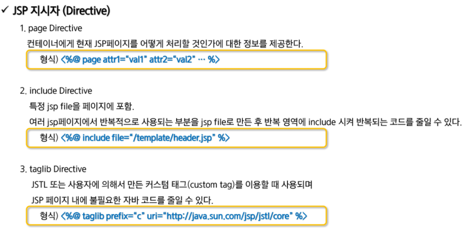
- 

### JSP 기본객체

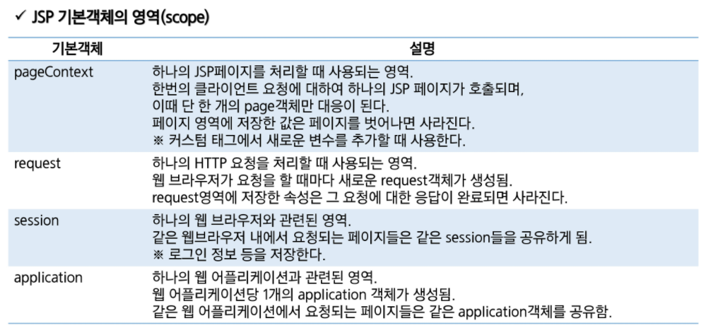

---------------------------------

### Web Application?

- HTTP
  - Stateless
    - connect -> request -> response -> disconnect
    - client를 기억하지 못한다.
  - client를 기억하는 기술은?
    - Cookie / Session / JWT(json web token)
  - Request Method
    - GET, POST, PUT, DELETE, ..
  - Port
    - 80 / 8080
  - domain / url / parameter
- Web Browser
- HTML, CSS, Javascript
- Web Server
  - for Static Contents
  - HTML, CSS, Javascript, Images
  - Apache
- Web Application Server (WAS)
  - for Dynamic Contents
  - Servlet, JSP, (PHP, ASP, Django, Node.js)
  - for Business Logic
  - Tomcat, Jeus, WebLogic, Resin
  - WAS 는 내부적으로 Web Server를 포함하는 경우가 많다.
  - 서버가 어떻게 동작하는가?
    - 클라이언트가 static contents(파일)을 요청할 때, 서버는 파일을 읽고, 클라이언트로 응답한다.
      - 자바 코드 필요 없다
    - 다이나믹 컨텐츠를 요청할 때, 서버는 웹 모듈 (Servlet)을 호출하고 그 결과를 클라이언트에게 return 한다
    - Tomcat이 어떻게 엡 모듈을 콜하고 결과를 얻을것인가?
      - 톰캣하고, 웹 모듈 사이에는 룰이 있다.
      - Container와 component가 그 룰을 지킨다
        - 톰캣 : 컨테이너
        - Servlet / JSP : 컴포넌트
        - 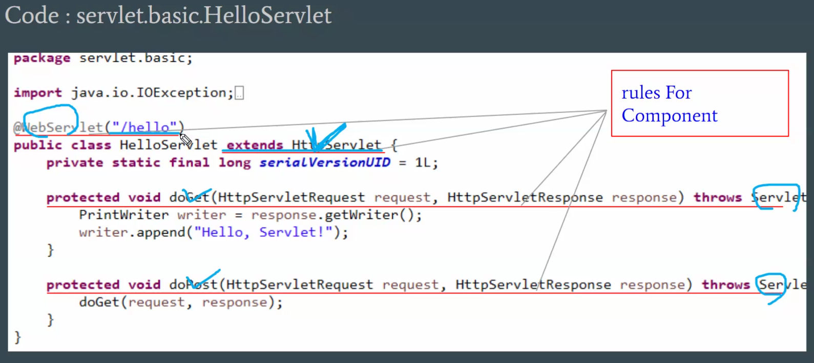
    - Connection Pool
      - JDBC 연결, 이제 classforname 안쓴다.
      - 커넥션 풀링 기법 쓰는 이유
        - 개발자 레벨 코드에서 커넥션 객체에 관리가 문제가 많기 때문에 컨테이너에서 관리
          - 반납하지 않으면 난리난다
        - 커넥션 객체를 만드는 것에 시간이 걸리기 때문에 미리 만들어서 재활용하자
  - URL Mapping
    - 클라이언트 - 서블릿 양쪽에서 어떠한 일을 하겠다는 요청을 할 때
      - 요청의 처리자 를 알려줘야한다. (URL 매핑)
- Database
- Cloud

