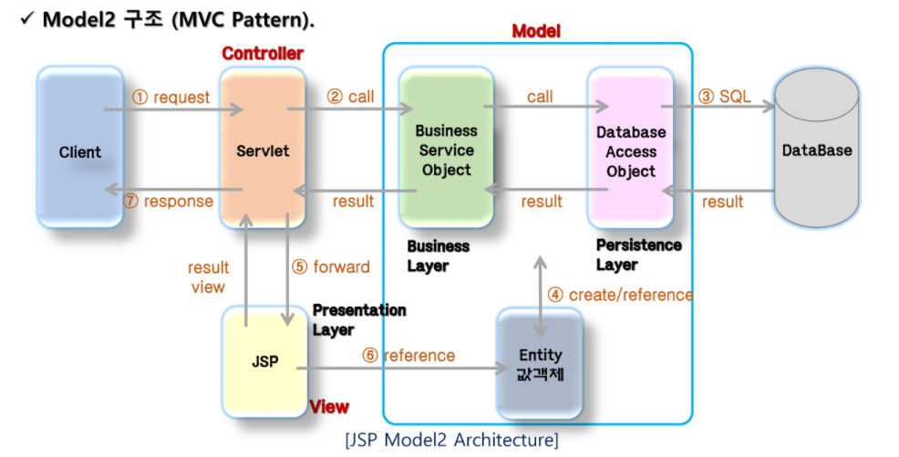

## Model1

- Web Application Architecture
  - JSP를 이용하여 구성할 수 있는 Web Application Architecture은 크게 model1, model2로 나뉜다
  - JSP가 클라이언트의 요청에 대한 로직 처리와 response page에 대한 처리를 모두 하느냐, 아니면 response page에 대한 처리만 하는지가 가장 큰 차이점
  - model2 구조는 MVC 패턴을 웹 개발에 도입한 구조
- model 1구조
  - view와 logic을 JSP 페이지 하나에서 처리하는 구조
  - client로부터 요청이 들어오면 jsp 페이지는 java beans나 별도의 service class를 이용하여 작업을 처리, 결과를 클라이언트에 출력한다
  - 
  - 

## Model2

