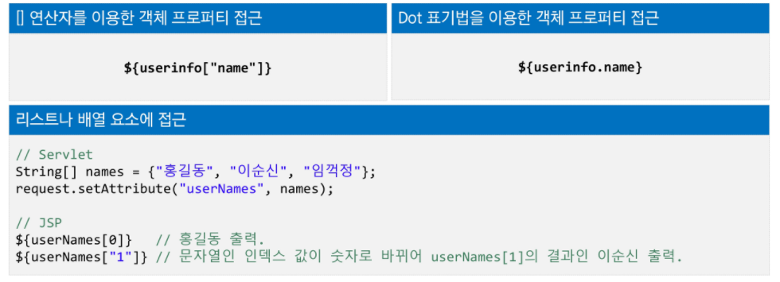

## EL (Expression Language)

- EL

  - EL은 표현을 위한 언어로 JSP 스크립트 표현식을 대신하여 속성 값을 쉽게 출력하도록 고안된 언어
  - 표현식 `<%= %>`를 대체할 수 있다.

- 문법

  - 

  - [] 연산자

    - 

    - getter, setter 이름을 반드시 맞춰줘야한다. (EL은 개터 세터의 이름으로 확인)

- 내장 객체

  - 
  - 객체 접근
    - pageScope > requestScope > sessionScope > applicationScope 순으로 객체를 찾는다.

## JSTL (Jsp Standard Tag Library)

- jar 파일 설치, directive 선언 해줘야한다.
- 

---

