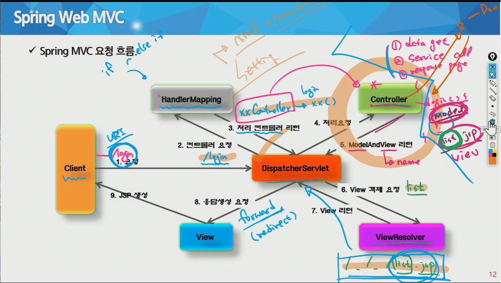
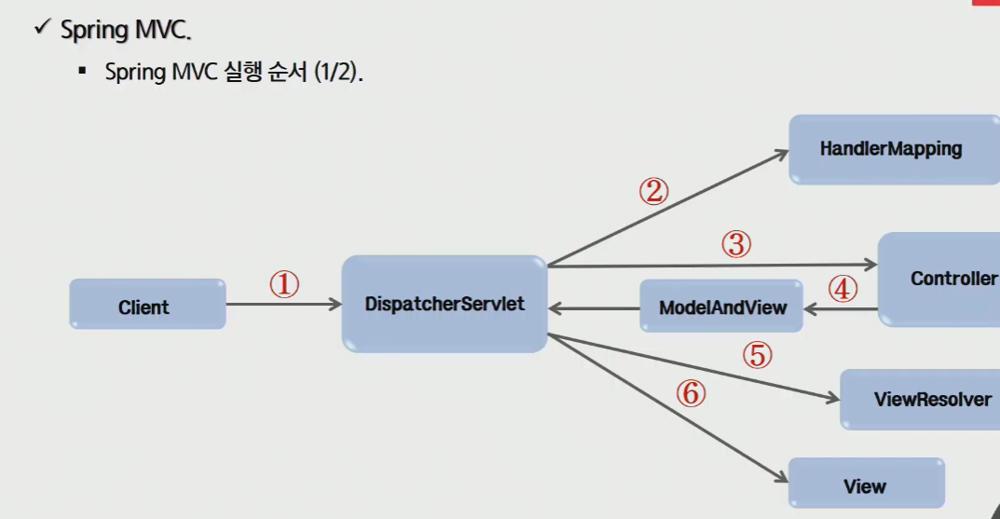
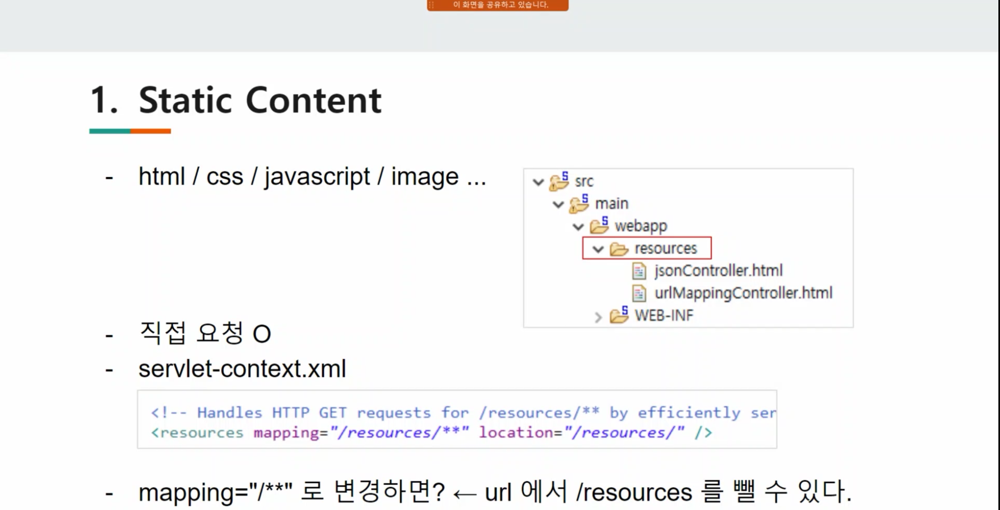
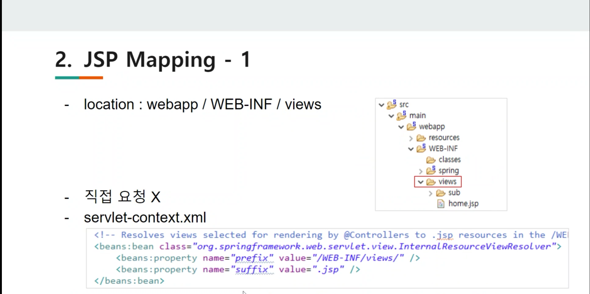
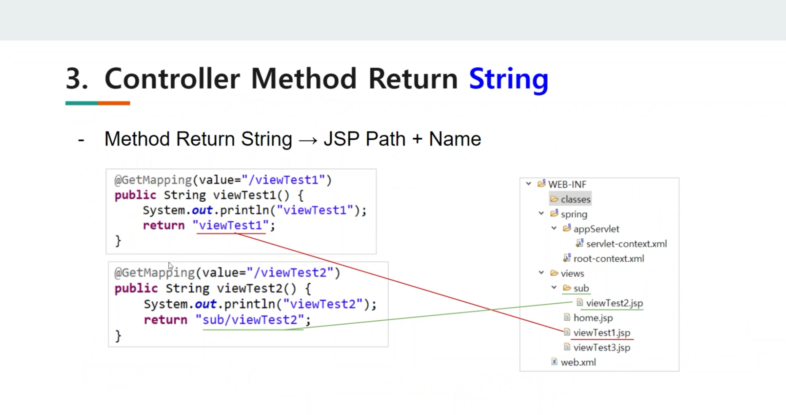
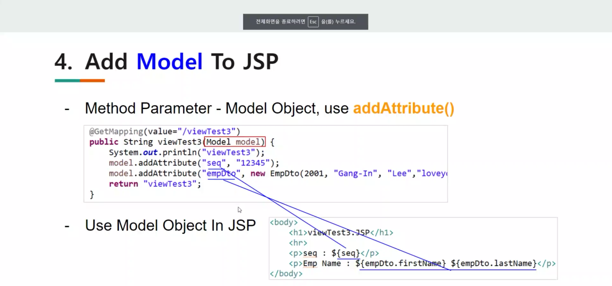

### Sping MVC

- 특징

  - DI나 AOP 같은 기능 뿐만 아니라, 서블릿 기반의 웹 개발을 위한 MVC Framework를 제공
  - Spring MVC는 모델2 아키텍쳐와 프론트 컨트롤러 패턴을 프레임워크 차원에서 제공
  - Spring MVC 프레임워크는 스프링을 기반으로 하고 있기 때문에 Spring이 제공하는 Transaction 처리나 DI 및 AOP 등을 손쉽게 사용
  - act 하는 부분은 자동으로
    - Frame으로 처리
  - data 처리하는 부분은 자동X
    - 컨트롤을 하기 위한 사전 작업 : frontcontroller
    - 스프링이 대신해준다.
  - 포워드, 리다이렉트 하는 부분 다 사라진다.

- 구성요소

  - DispatcherServlet(Front Controller)
    - 모든 클라이언트의 요청을 받음
    - 컨트롤러에게 클라이언트의 요청을 전달하고, 컨트롤러가 리턴한 결과값을 뷰에게 전달하여 알맞은 응답을 생성
  - HandlerMapping
    - 클라이언트의 요청 URL을 어떤 컨트롤러가 처리할 지를 결정
    - URL과 요청 정보를 기준으로 어떤 핸들러 객체를 사용할지 결정하는 객체이며, DispatcherServlet은 하나 이상의 핸들러 매핑을 가질 수 있음
  - Controller
    - 클라이언트의 요청을 처리한 뒤, 모델을 호출하고 그 결과를 DispatcherServlet에 알려준다.

  - 컨트롤러는 우리가 만들고 위 2개는 만들지 않는다.

  - ModelAndView
    - 컨트롤러가 처리한 데이터 및 화면에 대한 정보를 보유한 객체
  - ViewResolver
    - 컨트롤러가 리턴한 뷰 이름을 기반으로 컨트롤러의 처리 결과를 보여줄 뷰를 결정
  - View
    - 컨트롤러의 처리결과를 보여줄 응답화면을 생성

- 구현
  - web.xml에 디스패쳐서블릿 등록 및 스프링 설정파일 등록
  - 설정파일에 HandlerMapping 설정
  - 컨트롤러 구현 및 Context 설정 파일(servlet-context.xml)에 등록
  - 컨트롤러와 JSP 연결을 위해 View Resolver 설정
  - JSP 코드 작성
- 컨트롤러 작성
  - 좋은 디자인은 컨트롤러가 많은 일을 하지 않고 서비스에 처리를 위임

- web.xml - DispatcherServlert 설정 // 중요

----------------

