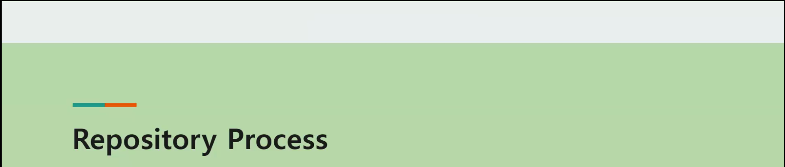

### 컨트롤러

- @Controller 선언

  - Class 타입에 적용

  - ```java
    @Controller
    @RequestMapping("/reboard") // 아래 url 앞에 붙음
    public class ReboardController{
        @Autowired
        private ReboardService reboardService;
        
        @RequestMapping(value="/list", method = RequestMethod.GET)
        public ModelAndView list(@RequestParam Map<String, String>map){
            // 코드
        }
    }
    ```

  - 파라미터 중요

    - @RequestBody
    - @RequestParam
    - @ModelAttribute -> 다른 쪽으로 넘겨줄 때 이름 설정

- 파일 업로드

  - 
  -   

------------------------------




