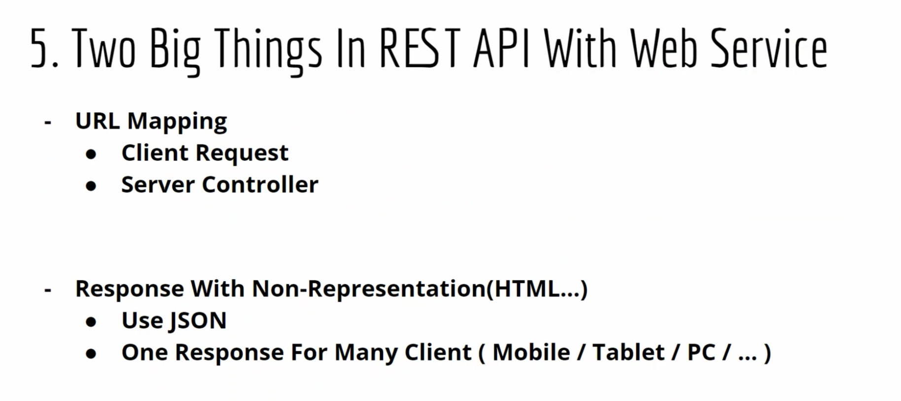

### MyBatis 개요와 특징

- Java Object와 SQL문 사이의 자동 매핑 기능을 지원하는 ORM Framework
  - SQL을 별도의 파일로 분리해서 관리
  - Object - SQL 사이의 파라미터 매핑 작업을 자동으로 해줌
  - 새로운 DB 프로그래밍 패러다임을 익혀야하는 부담 없이 개발자가 익숙한 SQL을 그대로 이용하면서 JDBC 코드 작성의 불편함을 제거해 주고, 도메인 객체나 VO 객체를 중심으로 개발이 가능
- 특징
  - 쉬운 접근성과 코드의 간결함
    - JDBC의 모든 기능을 MyBatis가 대부분 제공
    - 복잡한 JDBC 코드를 걷어내며 깔끔한 소스코드 유지
    - 수동적인 파라미터 설정과, 쿼리 결과에 대한 매핑 구문을 제거
  - SQL문과 프로그래밍 코드의 분리
    - SQL에 변경이 있을 때 마다 자바 코드를 수정하거나 컴파일 하지 않아도 됨
    - SQL 작성과 관리 또는 검토를 DBA와 같은 개발자가 아닌 다른 사람에 맡길 수 있음
  - 다양한 프로그래밍 언어로 구현가능

--------------------

## REST API

- 뭘써도 좋다 (정답이 없다는 의미)

