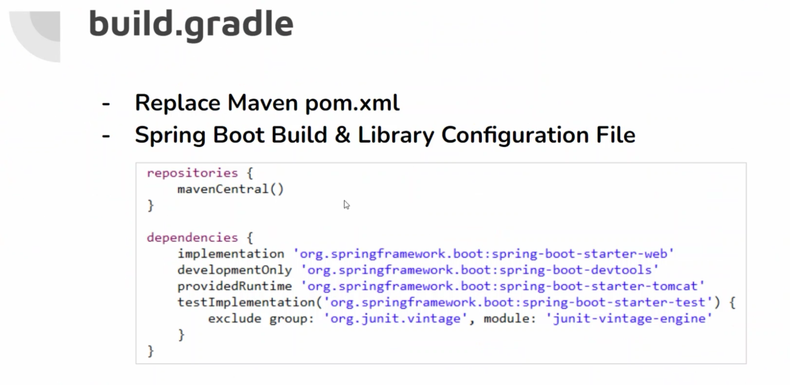

## REST API

### REST (Representational State Transfer)

- 하나의 URI는 하나의 고유한 리소스를 대표하도록 설계된다는 개념에 전송방식을 결합해서 원하는 작업을 지정한다
  - URI + GET/POST/PUT/DELETE

- 구성
  - 자원 - URI
  - 행위 - HTTP Method
  - 표현
  - 잘 표현된 HTTP URI로 리소스를 정희하고 HTTP method로 리소스에 대한 행위를 정의한다.
  - 리소스는 JSON, XML과 같은 여러 가지 언어로 표현할 수 있다.

- 기존 서비스와 REST Service

  - 기존 서비스 
    - 요청에 대한 처리를 한 후 가공된 data를 이용하여 특정 플랫폼에 적합한 형태의 View로 만들어서 반환
  - REST Service
    - data 처리만 한다 거나, 처리 후 반환될 data가 있다면 JSON이나 XML 형식으로 전달. VIew에 대해서는 신경 쓸 필요가 없다.
    - 위의 이유로 Open API에서 많이 사용
  - 

- REST

  - 기존의 전송방식과는 달리 서버는 요청으로 받은 리소스에 대해 순수한 데이터를 전송한다.

    - 

  - 기존의 GET/POST외에 PUT, DELETE 방식을 사용하여 리소스에 대한 CRUD 처리를 할 수 있다.

  - HTTP URI을 통해 제어할 자원을 명시하고 HTTP METHOD를 통해 해당 자원을 제어하는 명령을 내리는 방식의 아키텍쳐이다.

  - 가장 큰 단점은 딱 정해진 표준이 없다.

  - REST API 설정

    - Jackson library
    - 

  - Annotation

    - 

    

--------------------

- jsp 굳이 쓰진 않는다...
  - 설정을 통해서 가능은하다 정도만

- application.properties
  - https://docs.spring.io/spring-boot/docs/current/reference/htmlsingle/#appendix.application-properties.data
  - 여기서 확인
- 한글 on Boot
  - 설정안해도 된당~~~

