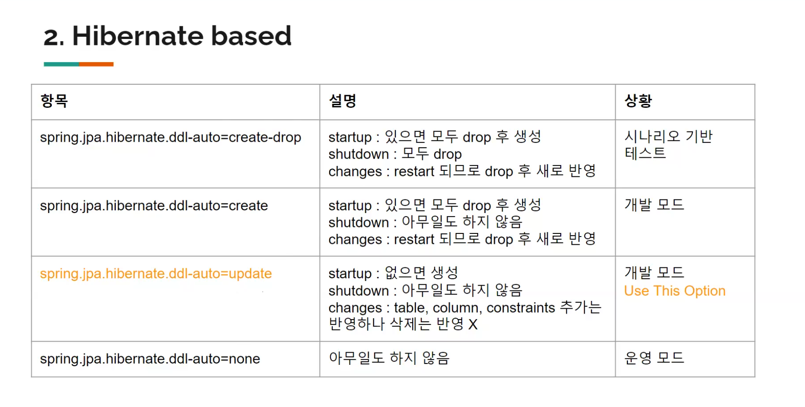
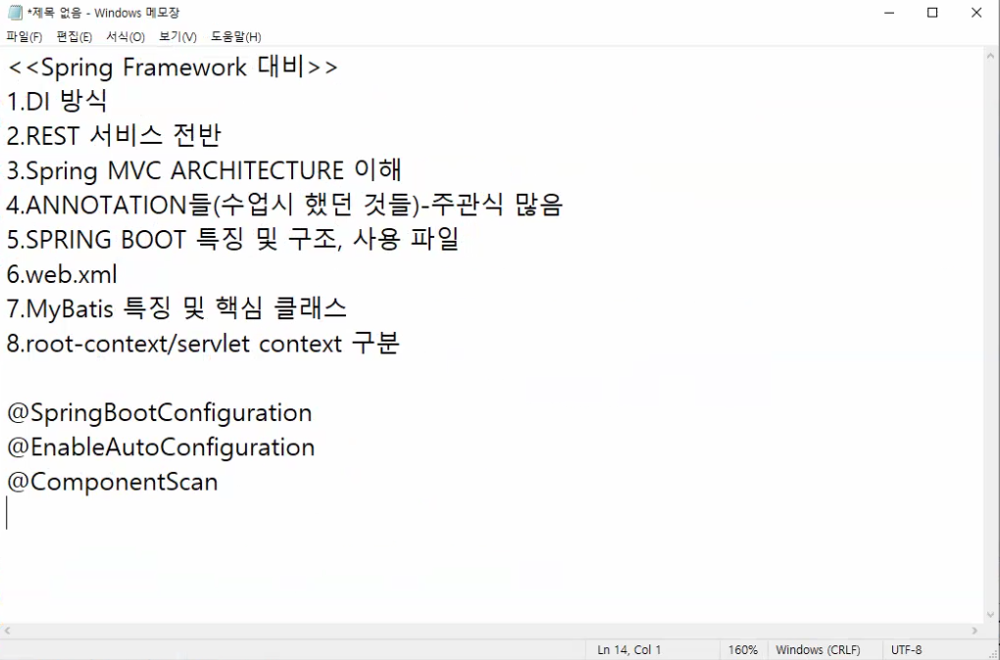

---------------------------

# 과평대비

- DI 방식
  - bean
  - xml
  - ?
- rest
  - UI 표시
  - 등록 수정 삭제 조회 상세
- MVC 아키텍쳐 이해
  - JSP 포함된 스프링 폴더 구죠
  - 컨텍스트.xml
- 어노테이션
  - 수업시에 했던것들
- 스프링부트
  - 메이븐 안나올듯..?
  - app.프로퍼티
  - 메이븐, 그래들 파일
  - 부트를 쓰면서 jsp
    - 프리픽스 서픽스 설정
- web.xml
  - 스프링 mvc
  - 디스패쳐 서블릿 등록되는 부분
  - 한글 인코딩하는 필터 등등
- My batis 핵심 특징
  - 장황
  - xml 문서
  - 설정에 대한 것과 쿼리가 따로
  - if, where, foreach 살펴보기 (라이브 수업 기준)
- 루트 서블릿 컨텍스트 구분
  - 쩌ㅃ쩌ㅃ