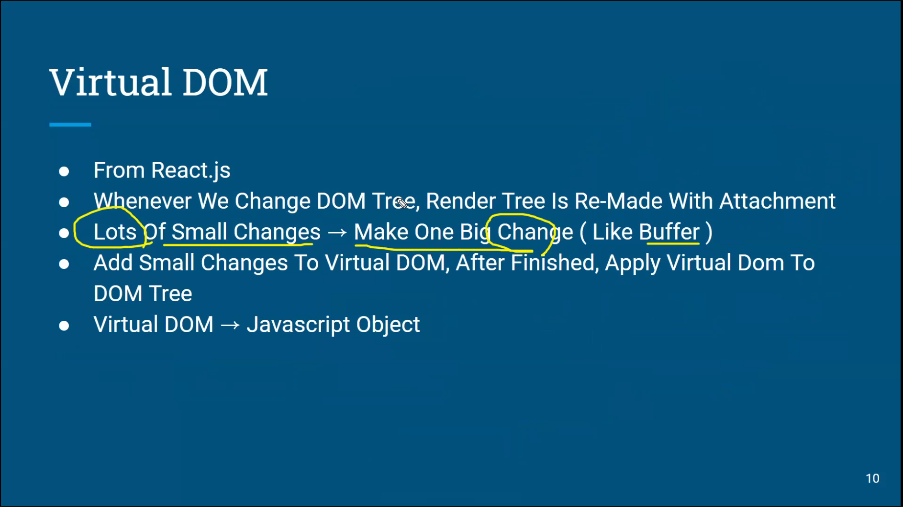

### Vue.js

- Evan You에 의해서 만들어짐 (가벼운걸 만들어 보고 싶은 생각으로 시작한 개인 프로젝트)
- 사용자 인터페이스를 만들기 위해 사용되는 오픈 소스 Progressive Framework
- 특징
  - 접근성
  - 유연성
  - 고성능

- MVVM 패턴
  - Model + View + ViewModel
  - 모델 : 순수 자바스크립트 객체
  - 뷰 : 웹페이지의 DOM
  - 뷰모델 : 뷰의 역할
  - 기존에는 자바스크립트로 뷰에 해당하는 DOM에 접근하거나 수정하기 위해 jQuery와 같은 라이브러리 용
  - 뷰는 뷰와 모델을 연결하고 자동으로 바인딩하므로 양방향 통신을 가능하게 함
  - 
  - 

- 뷰 객체 생성
  - 
  - 유효 범위
    - 뷰 인스터스를 생성하면 HTML의 특정 범위 안에서만 옵션 속성들이 적용
    - el 속성과 밀접한 관계가 있다.
    - 
    - 
- 뷰 객체 라이프 사이클
  - 
  - 
  - 라이프사이클은 크게 나누면, 인스턴스의 생성, 부착, 갱신, 소멸의 4 단계로 나뉜다.

- 보간법

  - 문자열
    - v-once
    - v-html=''

  - 자바스크립트 표현식 사용 가능

- template - directive
  - 디렉티브는 v- 접두사가 있는 특수 속성
  - 디렉티브 속성 값은 단일 자바스크립트 표현식이 된다 (v-for는 예외)
  - 디렉티브의 역할은 표현식의 값이 변경될 때 사이드 이펙트를 반응적으로 DOM에 적용
  - 
  - v-model
    - 양방향 바인딩 처리를 위해서 사용
    - form의 input, textarea
  - v-bind
    - 엘리먼트의 속성과 바인딩 처리를 위해서 사용
    - v-bind는 약어로 : 로 사용 가능
  - v-show
    - 조건에 따라 엘리먼트를 화면에 렌더링
    - style의 display를 변경
  - v-if, v-else-if, v-else
    - 조건에 안맞으면 div 자체가 사라짐
  - 
  - v-for
    - 배열이나 객체의 반복에 사용
    - v-for="요소변수이름 in 배열" v-for="(요소변수이름, 인덱스) in 배열"

----------------------------

