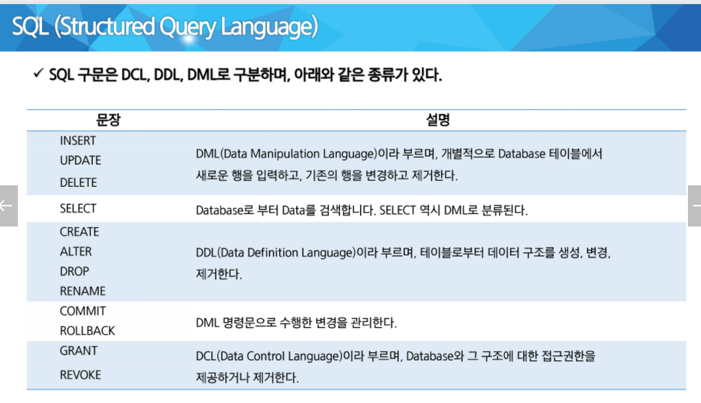
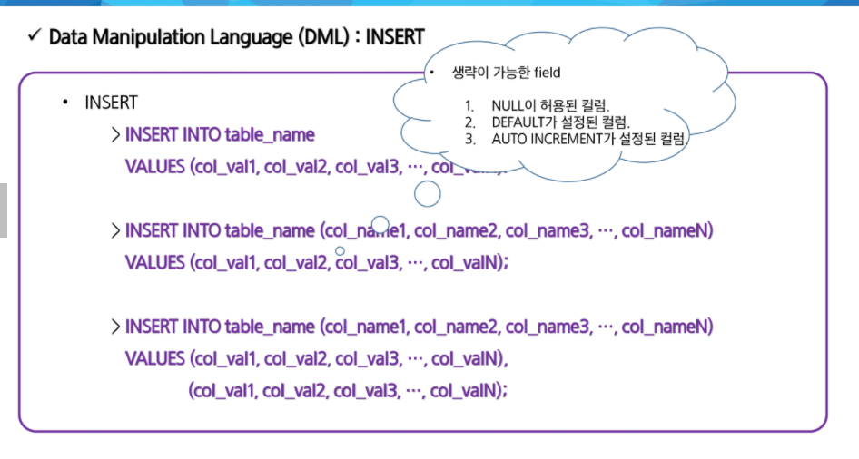
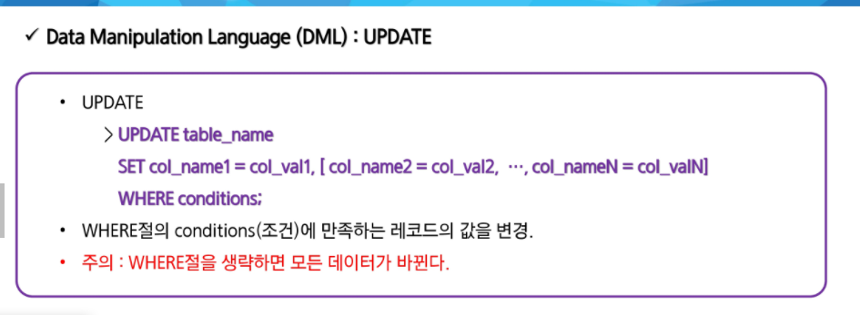
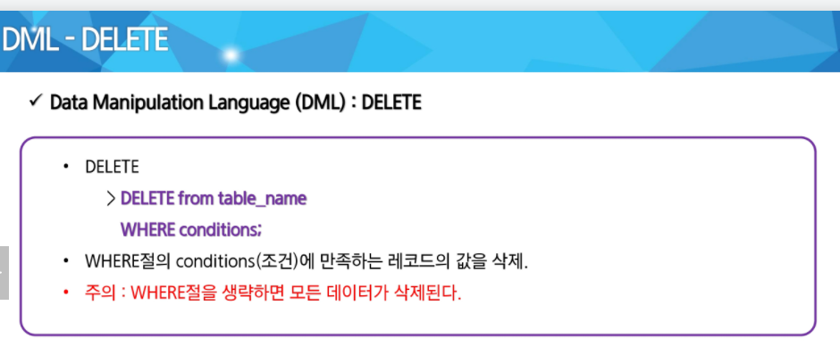
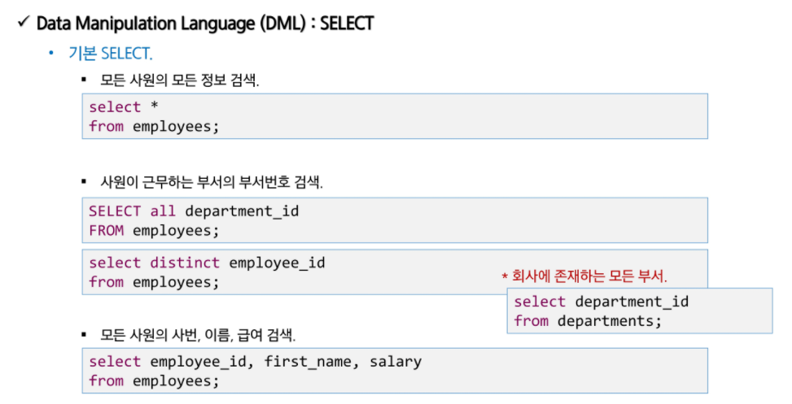

### RDBMS

- 관계형 ㅌ데이터베이스 시스템
- 테이블 기반의 DBMS
  - 데이터를 테이블 단위로 관리
    - 하나의 테이블은 여러 개의 컬럼으로 구성
  - 중복 데이터를 최소화 시킴
    - 같은 데이터가 여러 컬럼 또는 테이블에 존재했을 경우
      - 데이터를 수정 시 문제가 발생할 가능성이 높아짐 - 정규화
  - 여러 테이블에 분산되어 있는 데이터를 검색 시 테이블 간의 관계(join)를 이용하여 필요한 데이터를 검색

### SQL

- 데이터베이스에 있는 정보를 사용할 수 있도록 지원하는 언어

- 모든 DBMS에서 사용 가능

- 대소문자는 구별하지 않음 (단, 데이터의 대소문자는 구분)

  ```mysql
  use ssafydb;
  
  select *
  from employees
  where binary(first_name) = 'Steven';
  
  // binary로 감싸줘야 대소문자 구분이 가능하다
  ```

  

- insert

  

- update

  

  

- delete

  


- select

  