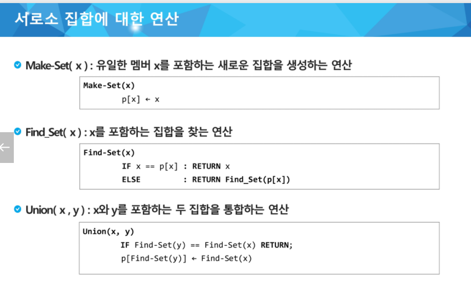

## 이클립스 디버거 활용

- 상단창에 벌레

- 코드 창 숫자 옆에 우클릭 해서 토클 break 포인트 표시
- f11 : 실행 단축키
- f6 : 라인 다음으로
- f5 : 메서드 안으로 진입하는 것
  - 실수로 f5누를 때 (메서드 안으로 잘 못 들어간 경우) f7로 탈출 (뒤로가기)

- f8 : 다음 breakpoint까지 진행
- 조건도 달 수 있음, 브레이킹 포인트 우클릭 + 프로퍼티 + 컨티셔너
- 윈도우 + preference + debug + step filtering 걸면 기존패키지에 있는 것들은 디버깅하지 않음
- if 문 안에 || && 로 연산되어있는 것을 줄바꿈으로 디버깅 가능하다.

## 서로소 집합

- Disjoint-set
- 서로소 또는 상호 배타 집합들은 서로 중복 포함된 원소가 없는 집합들이다. 다시 말해 교집합이 없다.
- 집합에 속한 하나의 특정 멤버를 통해 각 집합들을 구분한다. 이를 대표자(representative)라 한다.
- 서로소 집합을 표현하는 방법
  - 연결 리스트
  - 트리
- 서로소 집합 연산
  - Make-Set(x)
  - Find-Set(x)
  - Union(x, y)
- 서로소 집합 표현 - 연결리스트
  - 같은 집합의 원소들은 하나의 연결리스트로 관리한다.
  - 연결리스트의 맨 앞의 원소를 집합의 대표 원소로 삼는다.
  - 각 원소는 집합의 대표원소를 가리키는 링크를 갖는다.

- 서로소 집합 표현 - 트리
  - 같은 집합의 원소들을 하나의 트리로 표현한다.
  - 자식 노드가 부모 노드를 가리키며 루트 노드가 대표자가 된다.

- 연산
  - Make-Set(X)
    - 유일한 멤버 x를 포함하는 새로운 집합을 생성하는 연산
  - Find_Set(x)
    - x를 포함하는 집합을 찾는 연산
  - Union(x, y)
    - x와 y를 포함하는 두 집합을 통합하는 연산



- 연산의 효율을 높이는 방법
  - Rank를 이용한 Union
    - 각 노드는 자신을 루트로 하는 subtree의 높이를 rank로 저장한다
    - 두 집합을 합칠 때 rank가 낮은 집합을 rank가 높은 집합에 붙인다.
  - Path compression
    - Find-Set을 행하는 과정에서 만나는 모든 노드들이 직접 root를 가리키도록 포인터를 바꾸어준다.

## 최소 신장 트리

- 그래프에서 최소 비용 문제
  - 모든 정점을 연결하는 간선들의 가중치의 합이 최소가 되는 트리
  - 두 정점 사이의 최소 비용의 경로 찾기 (최단 경로)
- 신장 트리
  - n 개의 정점으로 이루어진 무향 그래프에서 n개의 정점과 n-1개의 간선으로 이루어진 트리
- 최소 신장 트리 (Minimum Spanning Tree)
  - 무향 가중치 그래프에서 신장 트리를 구성하는 간선들의 가중치의 합이 최소인 신장 트리

## KRUSKAL 알고리즘

- 간선을 하나씩 선택해서 MST를 찾는 알고리즘
  - 최초, 모든 간선을 가중치에 따라 오름차순으로 정렬
  - 가중치가 가장 낮은 간선부터 선택하면서 트리를 증가시킴
    - 사이클이 존재하면 다음으로 가중치가 낮은 간선 선택
  - n-1 개의 간선이 선택될 때 까지 반복

- ```java
  MST-KRUSKAL(G, w)
      for vertex v in G.v
          Make-Set(v)
      G.E에 포함된 간선들을 가중치 w를 이용한 오름차순 정렬
      for 가중치가 가장 낮은 간선 (u, v) in G.E 선택(n-1개)
          if Find-Set(u) != Find-Set(v)
              Union(u,v)
  ```

## PRIM 알고리즘

- 하나의 정점에서 연결된 간선들 중에 하나씩 선택하면서 MST를 만들어 가는 방식
  - 임의 정점을 하나 선택해서 시작
  - 선택한 정점과 인접하는 정점들 중의 최소 비용의 간선이 존재하는 정점을 선택
  - 모든 정점이 선택될 때까지 반복
- 서로소인 2개의 집합 정보를 유지
  - 트리 정점들 - MST를 만들기 위해 선택된 정점들
  - 비트리 정점들 - 선택되지 않은 정점들

```java
MST-PRIM(G, r)
    result <- 0, cnt <- 0;
	for u in G.V
        minEdge[u] <- 입력
    minEdge[r] <- 0; // 시작 정점 r의 최소비용 0 처리
	while(true)
        u <- Extract-Min(); // 최소비용 정점 찾기
		visited[u] <- true // 방문 처리
        result += minEdge[u] // 비용 누적
        if(++cnt == N) break;
		for v in G.adj[u] // u의 인접정점들
            if visited[v] == false && w(u. v) < minEdge[v]
                minEdge[v] = w(u, v)
   return result
```


간선수 많으면 프림

아니면 크루스칼