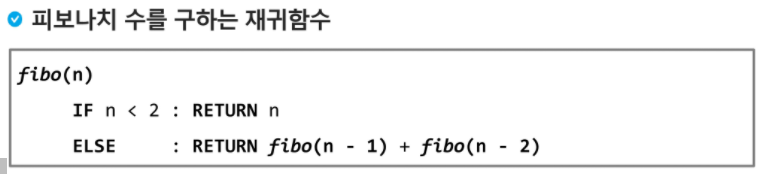
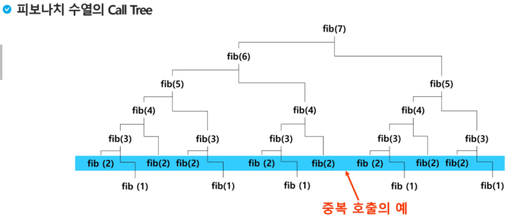
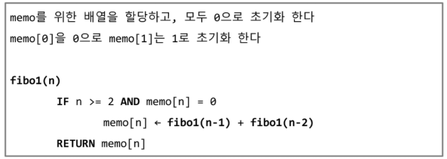
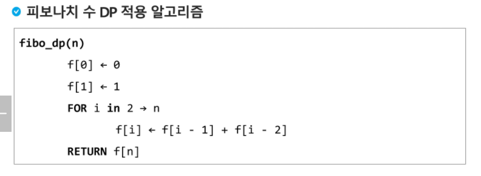

### 피보나치 수열

- F(N) = F(N-1) + F(N-2)
- 재귀함수로 구현 가능
- 
  - 엄청난 중복 호출이 존재한다
    - 

### 메모이제이션

- 컴퓨터 프로그램을 실행할 때 이전에 계산한 값을 메모리에 저장해서 매번 다시 계산하지 않도록 하여 전체적인 실행 속도를 빠르게 하는 기술
- 동적 계획법의 핵심이 되는 기술
- 피보나치 수를 구하는 알고리즘에서 fibo(n)의 값을 계산하자마자 저장하면 실행시간을 O(n)으로 줄일 수 있다.
- 
- 추가적인 메모리 공간이 필요하다.
- 재귀 함수 호출로 인한 시스템 호출 스택을 사용하게 되고 실행 속도 저하 ?또는 오버플로우가 발생할 수 있다.

### 동적 계획법 Dynamic Programming

- 그리디 알고리즘과 같이 최적화 문제를 해결하는 알고리즘
- 먼저 작은 부분 문제들의 해를 구하고 이들을 이용하여 보다 큰 크기의 부분 문제들을 해결하여, 최종적으로 원래 주어진 문제를 해결하는 알고리즘 설계 기법

- 최적 부분 문제 구조
  - 최적화의 원칙 만족해야 동적 계획법 효율적으로 적용
    - 어떤 문제에 대한 해가 최적일 때 그 해를 구성하는 작은 문제들의 해 역시 최적이어야한다는 것
    - A~D 까지 최단이러면 A~D 사이에 있는 곳에 가는 곳까지도 최단이어야한다.

- 분할 정복
  - 연관 없는 부분 문제로 ㅇ분할한다
  - 부분 문제를 재귀적으로 해결한다
  - 부분 문제의 해를 결합한다
  - 병합 정렬, 퀵정렬
- DP
  - 부분 문제들이 연관이 없으면 적용할 수 없다
  - 즉 부분 문제들은 더 작은 부분 문제들을 공유한다.
  - 모든 부분 문제를 한번만 계산하고 결과를 저장하고 재사용한다.
- 적용 접근 방법
  - 최적해 구조의 특성 파악
    - 문제를 부분 문제로 나눈다
  - 최적해의 값을 재귀적으로 정의
    - 부분 문제의 최적해 값에 기반하여 문제의 최적해 값을 정의한다
  - 상향식 방법으로 최적해의 값을 계산하라
    - 가장 작은 부분 문제부터 해를 구한 뒤 테이블에 저장한다
    - 테이블에 저장되어 있는 부분 문제의 해를 이용하여 점차적으로 상위 부분 문제의 최적해를 구한다 (상향식 방법)

- 
- 