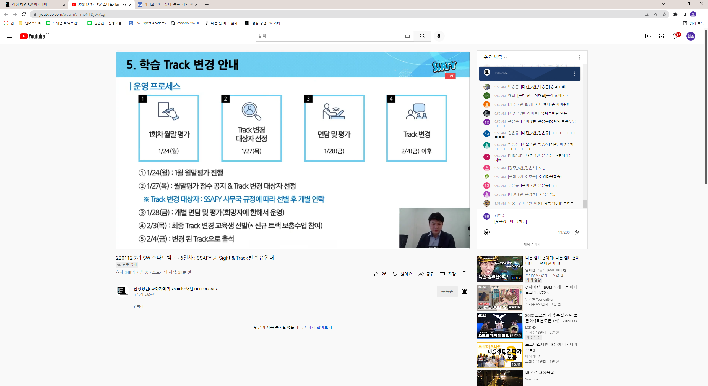

## 마크다운 문법의 장점

1. 문법이 직관적이고 쉽다.
2. 관리가 쉽습니다.
3. 지원 가능한 플랫폼이 다양합니다.

## 마크다운 단점

1. 표준이 없다.
2. 처음 학습하는 코스트가 발생한다.
3. HTML 모든 마크업 기능을 대신하지 못한다.

## 주의사항

1. 마크다운의 본질은 글에게 `역할` (` 백틱)을 부여하는 것
2. 정해진 역할에 맞는 `문법`을 사용해야한다. 
3.  예를 들어 **글씨의 크기를 키우고 싶다**(ctrl+b로 진하게) `내용`에 `제목`에 해당하는 역할을 부여하면 곤란하다.


## 마크다운 문법

`##` 샵 두개로 작성

-> 만약 Heading1으로 변경하고 싶다면? `ctrl+1`

1. 제목(Heading)
2. h1~h6

## 리스트(목록)

1. 순서가 있는 목록 (숫자로 작성됨)

- 순서가 없는 목록 `-``+``*`
- `tap 키`를 사용해서 들여쓰기가 가능하다.
  - `tap`으로 들여쓰기
- `shift + tab`으로 들여쓰기 취소

   			1.	 순서가 없는 목록안에 순서가 있는 목록 생성 가능

## 강조

1. 굵게 
   1. **(드래그 + ctrl + b)**  
   2. `**내용**`
   3. `__내용__` __내용__

 	2.	_기울임_
          	1.	 `_내용_`
          	2.	`*내용*`
          	3.	`드래그+ctrl+i`

3. ~~취소선~~
   1. `~~내용~~`


# 코드 블럭

- 한 줄 코드 인라인 코드와 여러 줄 코드인 블럭 코드로 나눌 수 있습니다.

  - 인라인 코드 : 백틱(`)을 사용해서 코드를 감싸줍니다. ` `inline code`  

  - 블럭 코드 :  ```python처럼 백틱을 3번 입력하고 코드의 종류를 작성

    ```python
    print("hello")
    for i in range(10):
        print(i)
    ```

    ```html
    <h1>
        심지어 자동원성도 해줌
    </h1>
    ```

# 링크

- `[표시할 글자](이동할 주소)` 형태로 작성
- [google](https://google.com)
- 이동하고자 한다면 `ctrl + click`

# 이미지

- ``
- 대체텍스트란, 이미지가 정상적으로 불러와 지지 않았을 때 표시되는 문구입니다.
- typora에는 이미지를 드래그 앤 드랍만으로도 적용시킬 수 있습니다.




## 주의사항

1. 이미지 업로드 전 저장하기


## 표

- `|` -> 파이프라인

- `ctrl+t` 단축키로 작성

- 행을 늘릴 때는 `ctrl + enter`

  |      |      |      |
  | :--: | ---- | ---- |
  |      |      |      |
  |      |      |      |

---

## 구분선

- `---` 하이픈 3개

---

---


`ctrl + /` 로 어떤 문법으로 작성되어 있는지 확인 가능하다

`ctrl + s` 항상 사용하기


