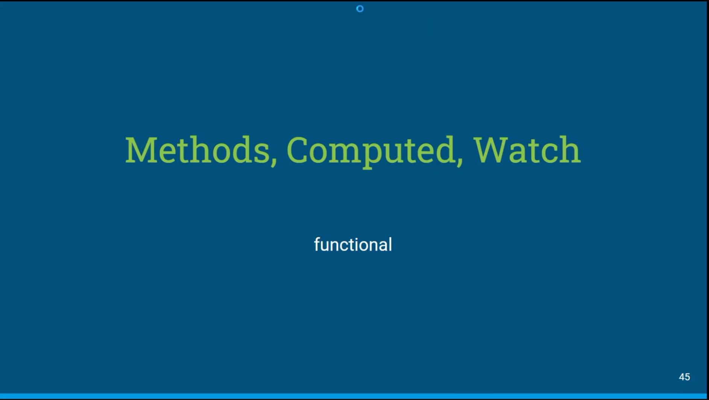
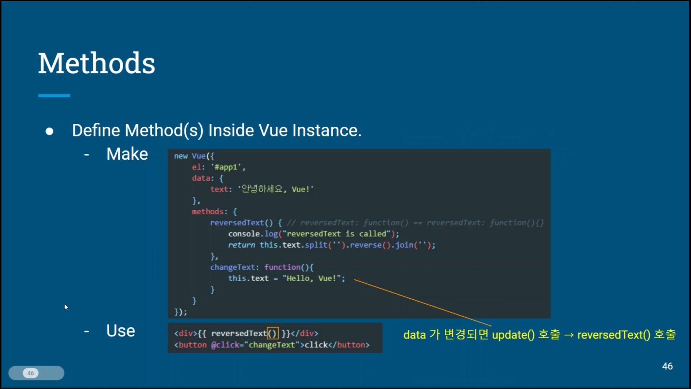
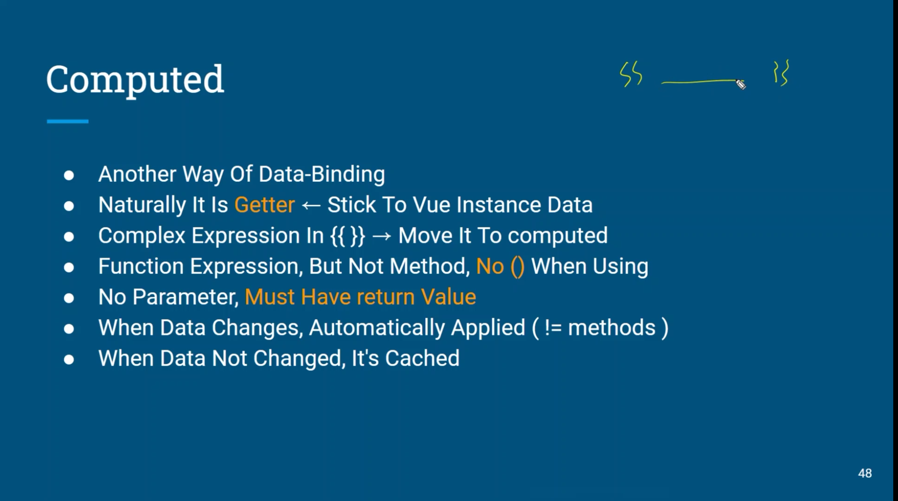
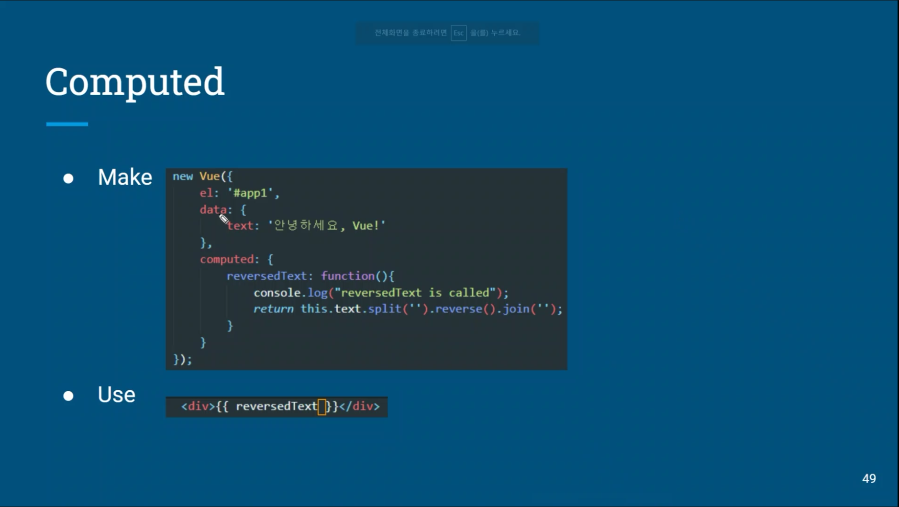
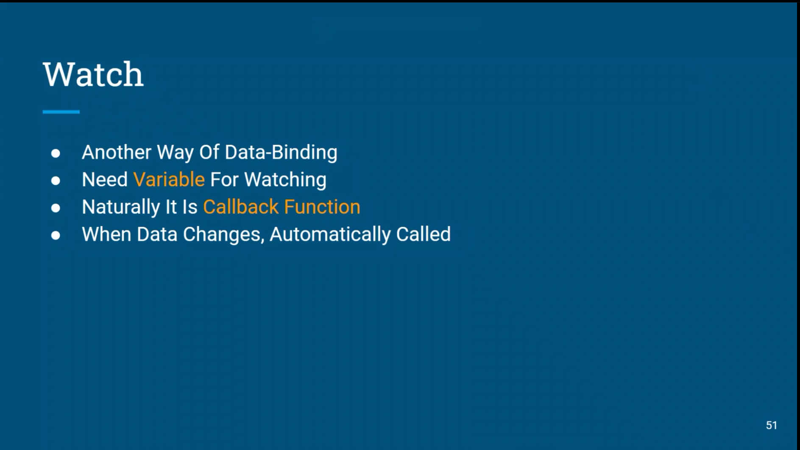
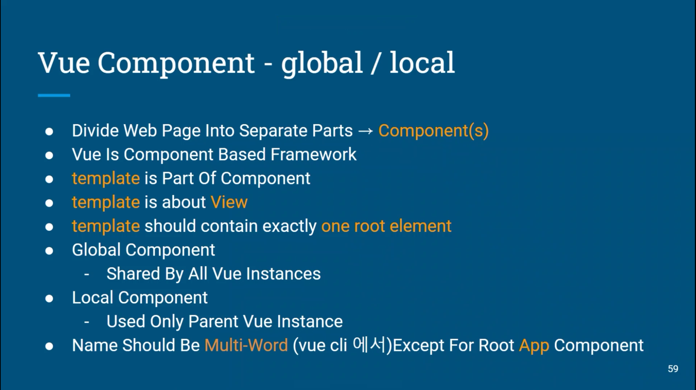
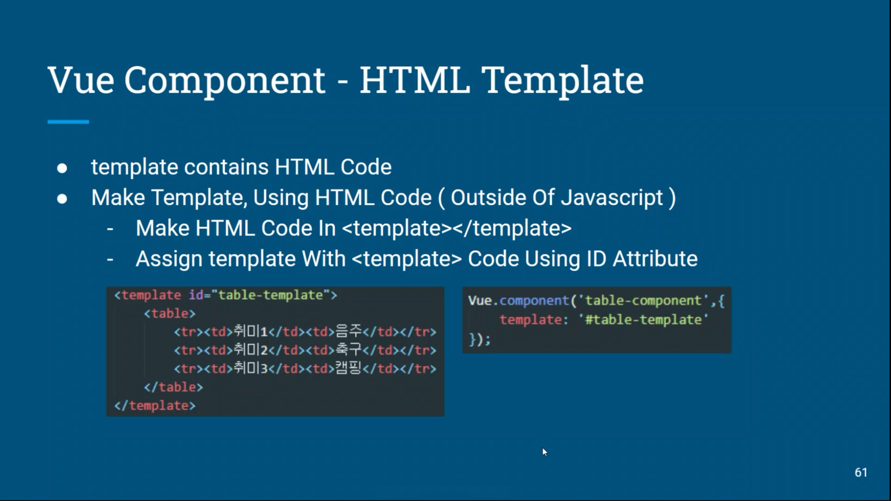
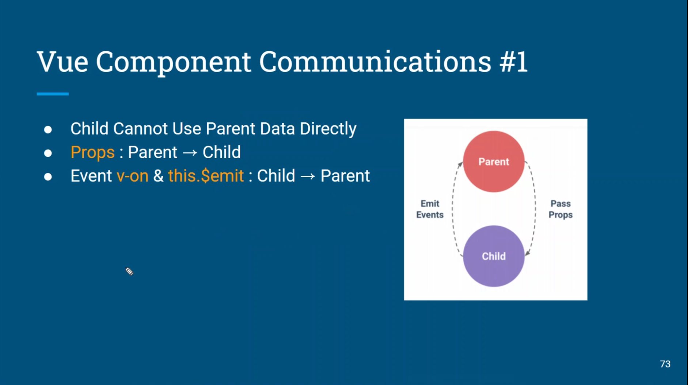
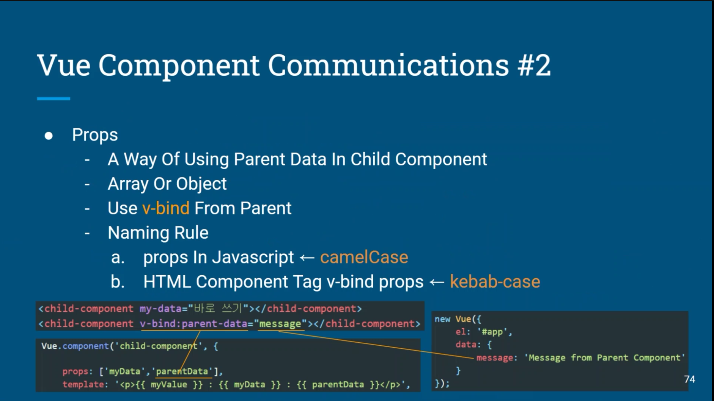

### Vue method

- 뷰 인스턴스는 생성과 관련된 data 및 method의 정의 가능
- method안에서 data를 this.데이터이름 으로 접근가능

### Vue filter

- 포맷을 쓸 때 사용하면 좋다
- 화면에 표시되는 텍스트의 형식을 쉽게 변환해주는 기능
- 표현식에 새로운 결과 형식을 적용
- 중괄호 보간법 {{}} 또는 v-bind 속성에서 속성에서 사용이 가능

### Vue computed 속성

- 특정 데이터의 변경사항을 실시간으로 처리
- 캐싱을 이용해 데이터의 변경이 없을 경우 캐싱된 데이터를 반환

### Vue watch 속성

- Vue instance의 특정 프로퍼티가 변경될 대 실행할 콜백함수 설정

### Vue Event

- DOM Event를 청취하기 위해 v-on directive 사용
- inline event handling
- method를 이용한 이벤트 핸들링

### Component

- 뷰의 가장 강력한 기능 중 하나
- HTML Element를 확장하여 재사용 가능한 코드를 캡슐화
- Vue Component는 Vue Instance이기도 하기 때문에 모든 옵션 객체를 사용
- Life Cycle Hook 사용 가능
- 전역 컴포넌트와 지역 컴포넌트

### Component간 통신

- 상위(부모) - 하위(자식) 컴포넌트 간의 data 전달방법
- 부모에게 자식 : props라는 특별한 속성을 전달 (Pass Props)
- 자식에서 부모 : event로만 전달가능 (Emit Event)

-----------------

