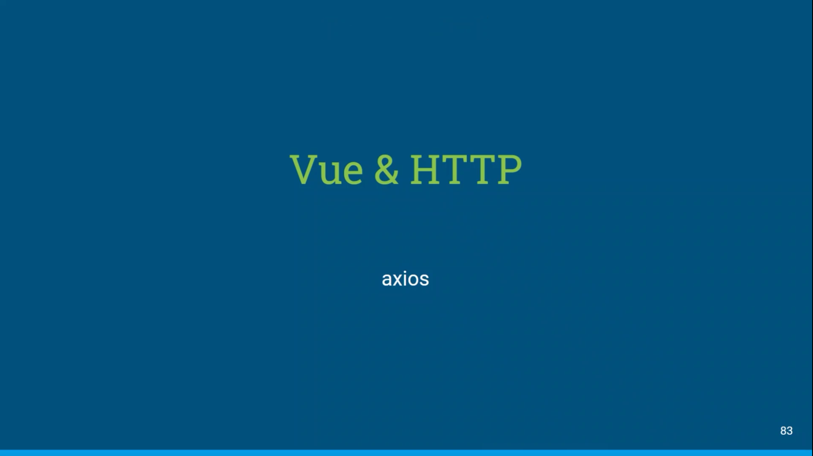

### Axios

- Vue에서 권고하는 HTTP 통신 라이브러리
- Promise 기반의 HTTP 통신 라이브러리, 다른 HTTP 통신 라이브러리들에 비해 문서화가 잘 되어 있고 API가 다양하다
- axios.get(URL) << Promise 객체를 return // then, catch 사용가능

### vue-router

- 라우팅 : 웹페이지 간의 이동 방법
- Vue.js의 공식 라우터
- 라우터는 컴포넌트와 매핑
- Vue를 이용한 SPA를 제작할 때 유용
- URL에 따라 컴포넌트를 연결하고 설정된 컴포넌트를 보여준다.

---------------

