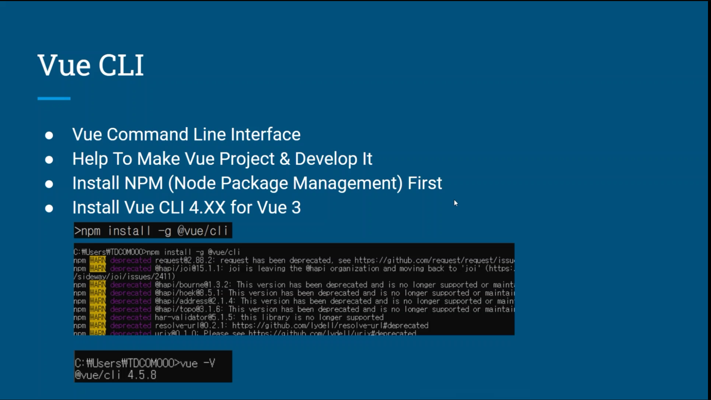
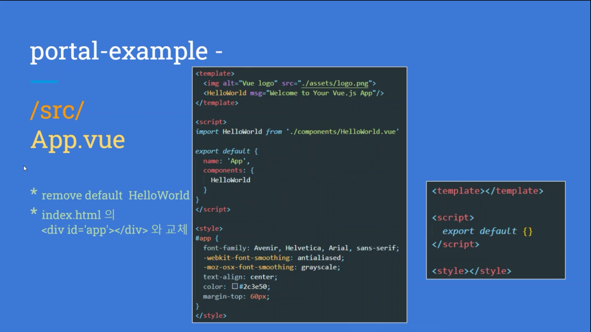

## SFC

- SFC
  - 확장자가 .vue인 파일
  - .vue = template + script + style
  - 구문 강조가 가능
  - 컴포넌트에만 CSS의 범위를 제한할 수 있음
  - 전처리기를 사용해 기능의 확장이 가능
- `<template>`
  - 기본 언어 : html
  - 각 *.vue 파일은 한 번에 최대 하나의 <template> 블록을 포함할 수 있다
  - 내용은 ㅁ문자열로 추출되어 컴파일 된 뷰 컴포넌트의 template 옵션으로 사용

- `<script>`
  - 기본 언어 js
  - 각 뷰 파일은 한번에 최대 하나의 <script> 블록을 포함할 수 있다
  - ES6를 지원하여 import와 export 사용가능
- `<style>`
  - 각 뷰 파일은 여러 개의 스타일 태그를 지원
  - scoped 속성을 이요하여 현재 컴포넌트에서만 사용가능한 css를 지정가능

-------------------------------------

