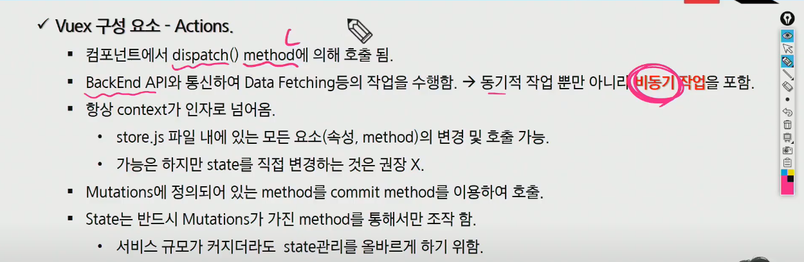
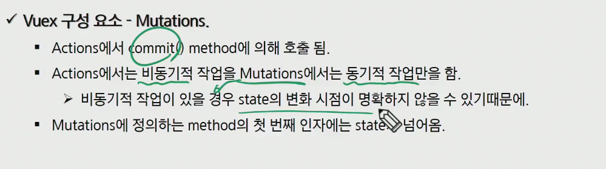

## vuex

- 상태관리패턴 + 라이브러리
- application 모든 component들의 중앙 저장소 역할
- 상위 하위의 단계가 많이 복잡해지면 데이터의 전달하는 부분이 매우 복잡해짐
- application이 여러 구성 요소로 구성되고 더 커지는 경우 데이터를 공유하는 문제가 발생

### 구성요소-state

- vuex는 single state tree(단일 상태 트리)를 사용
- 중앙에서 관리하는 모든 상태 정보를 state가 관리
- 여러 컴포넌트 내부에 있는 특정 state를 중앙에서 관리함
  - vuex 이전은 state를 찾기 위해 각 컴포넌트들을 직접확인
  - vuex를 활용하면 vuex store에서 컴포넌트에서 사용하는 state를 한 눈에 파악 가능
- mutataions에 정의된 method에 의해 변경
- state가 변경되면 해당 state를 공유하는 모든 컴포넌트의 DOM은 자동으로 랜더링 됨
- 모든 컴포넌트는 vuex store에서 state 정보를 가져와 사용
- 각 컴포넌트는 dispatch()를 사용하면 actions 내부의 method를 호출

### Actions

- 컴포넌트에서 dispatch() method에 의해 호출 됨
- 백엔드 API와 통신하여 Data Fetching등의 작업을 수행함
  - 동기적 작업 뿐만 아니라 비동기 작업 포함
- 항상 context가 인자로 넘어옴
  - 가능한 state 직접 변경 x
  - state.js 파일 내에 있는 모든 요소의 변경 및 호출 가능
- mutations 정의되어 있는 매서드를 커밋 매서드를 이용하여 호출
- state는 반드시 mutations가 가진 method를 통해서만 조작함
  - 서비스 규모가 커지더라도 state관리를 올바르게 하기 위함

### mutations

- Actions에서 commit() method에 의해 호출됨
- Actions에서는 비동기적 작업을 Mutations에서는 동기적 작업만을 함
  - 비동기적 작업이 있을 경우 state의 변화 시점이 명확하지 않을 수 있기 때문에
- Mutations에 정의하는 method의 첫번재 인자에는 state가 넘어옴

### Getters

- Computed와 유사
- State를 변경하지 않고 활용하여 계산을 수행
- Getters 자체가 state 자체를 변경하지는 않음